# 中山大學選課小助手

### [**點此前往中山選課小助手**](https://cellerylin.github.io/selector_helper)

此助手解決了中山選課系統的不便性，而且不需要驗證碼。

這是輔助大家選課的系統，僅供參考。課程資料是爬蟲下來的靜態資料，若有校方有異動，本人尚未更新的話請聯絡我，感謝。

目前尚未加入響應式視窗設計，建議使用電腦瀏覽。此網站係本人不務正業之作品，程式寫得非常亂，還請多多包含。

**目前版本： v4.0**
**主要功能：**

- 課表動態更新
- 一鍵加入必修課
- 更強大的篩選器以及智慧搜尋
- 搜尋學程
- 顯示衝堂
- 自動填課目前已經上線測試中！
- Local Storage 關閉瀏覽器自動儲存選課資料

**已知問題：**
- 校方資料有課號相同但課程卻不同的狀況，可能會造成顯示上的Bug，重新整理並且任意點選一堂課程再取消即可恢復正常。
- 介面有待優化

## **使用說明**

### **環境**
UI介面較為簡陋，日後會繼續更新，但已經比學校好看了吧。
左半邊為課表顯示區，右半邊為功能選擇區，在右半邊所更動的設定會即時顯示結果於左邊課表。
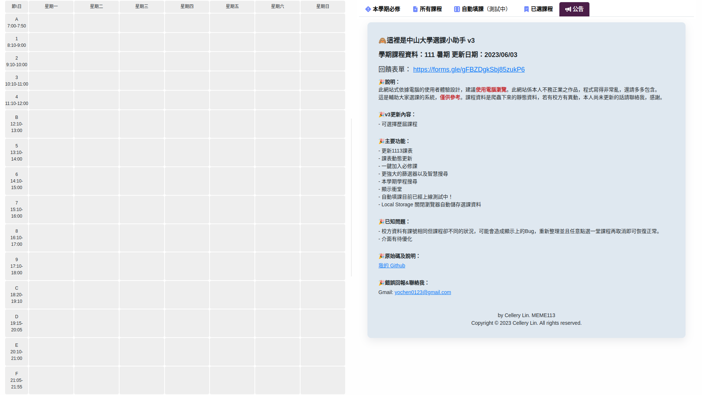

### **本學期必修**
選擇你的系所、年級和班別，再點選填入就可以把必修課全部加進去。
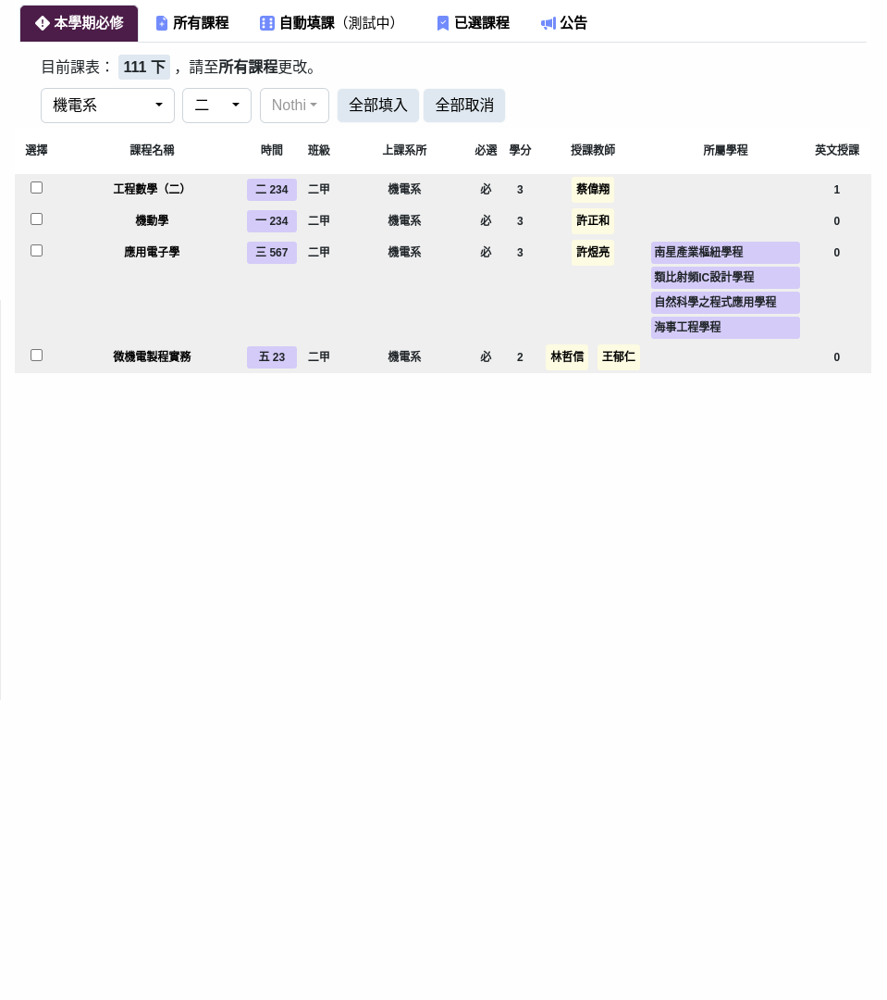

### **所有課程**
這裡是全校的課表，2000多筆一覽無遺。請先選擇欲瀏覽的學期。

因資料量太多會造成卡頓，所以預設只顯示前100筆課程內容，**建議善用綜合搜尋**，可以搜尋課程名稱、開課系所、老師、時間、學成等等。
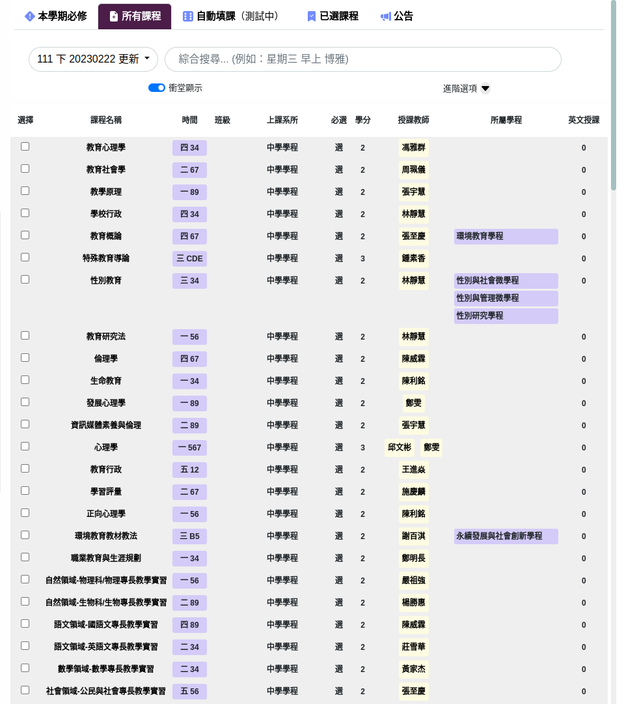

### **篩選器**
展開進階選項可以看到篩選器列表，您可以添加多個篩選器。
點選 **+** 號新增一個篩選器，可以個別對每個類別進行篩選。用英文逗號隔開可以包含進數個篩選內容。
**已知問題：若要搜尋年級為"(無)"的項目，請使用 "不包含 一, 二, 三, 四" 。**
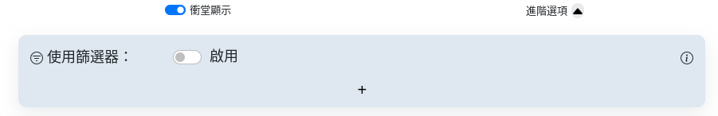

### **自動填課**
排完想修的課之後，若覺得學分數太少，可以來自動填課頁面，點選 **+** 號新增並排序你想修的課程類別，系統會根據您的空堂狀況安排以下課程給您，愈上面的志願會優先排入。
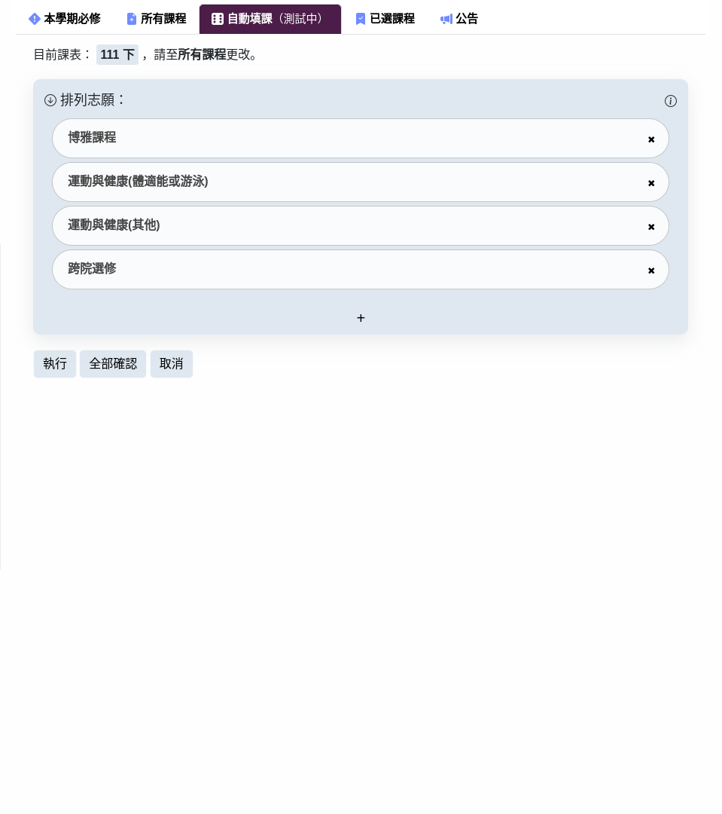

點選執行後會看到課程被 pending 上去(藍色半透明狀態，如下圖)，若不滿意可以再按一次執行或是取消。
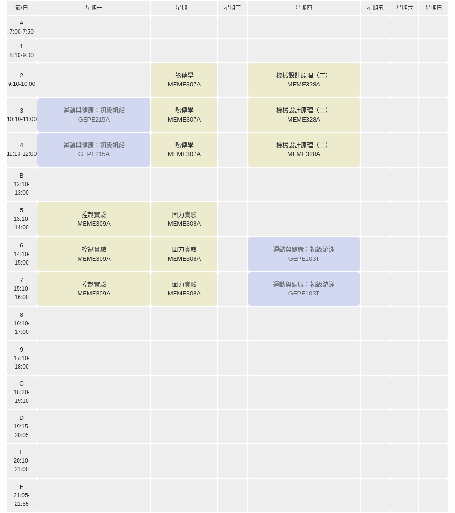
這些 pending 的課程並不會被添加到您的課表當中，直到您點選全部確認，此時 pending 的課程才會被固定下來(呈淡綠色狀態，如下圖)。
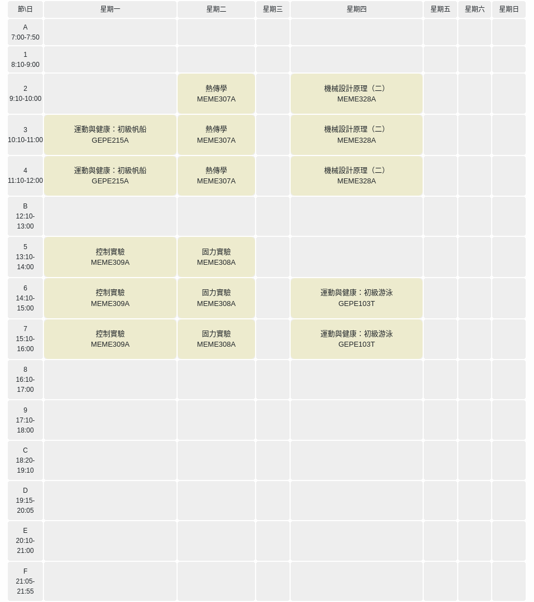

### <a name="export_js">**一鍵登記(JS)**</a>
這個功能提供一鍵登記到學校選課系統，適用初選一二、加退選一二等階段
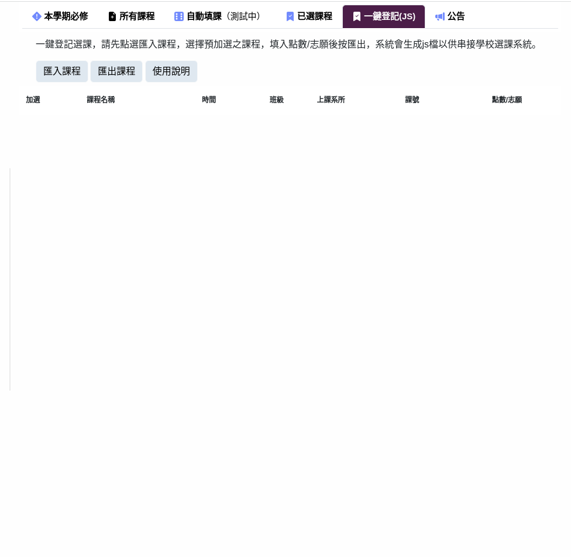
**使用方法**
1. 先點選匯入課程，所有選擇的課程會出現在下方。
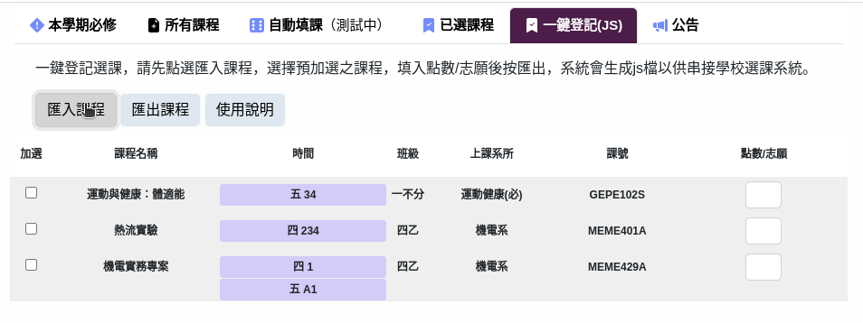

2. 選擇欲加選課程及填入點數或志願(請依照學校的規定勾選及填寫點數或志願，此以初選一為例)。
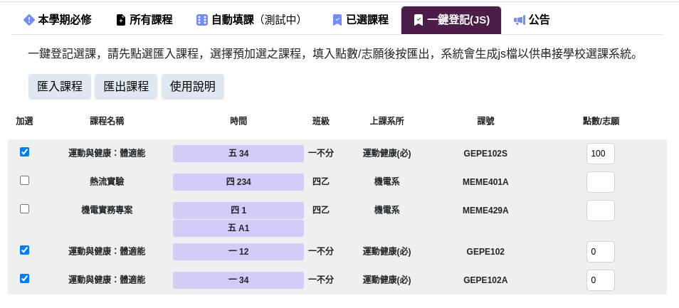

3. 點選匯出課程，系統會產生一個程式碼並自動複製到您的剪貼簿。您也可以自行複製底下的程式碼。
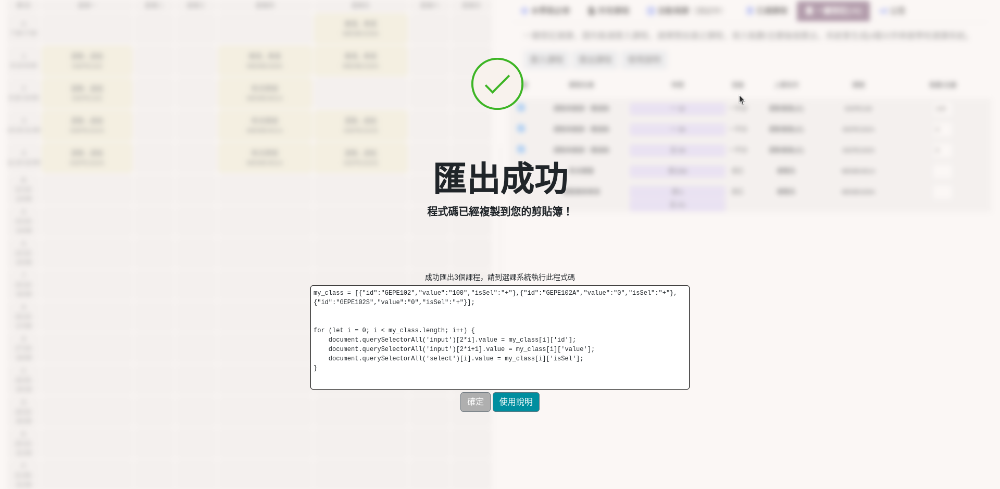

4. 登入選課系統，並且到要填課程的地方

5. 於任意處點右鍵，點選「檢查」/「檢查元素」(英文版 Inspect)或直接按鍵盤F12，您的瀏覽器會出現開發者工具。
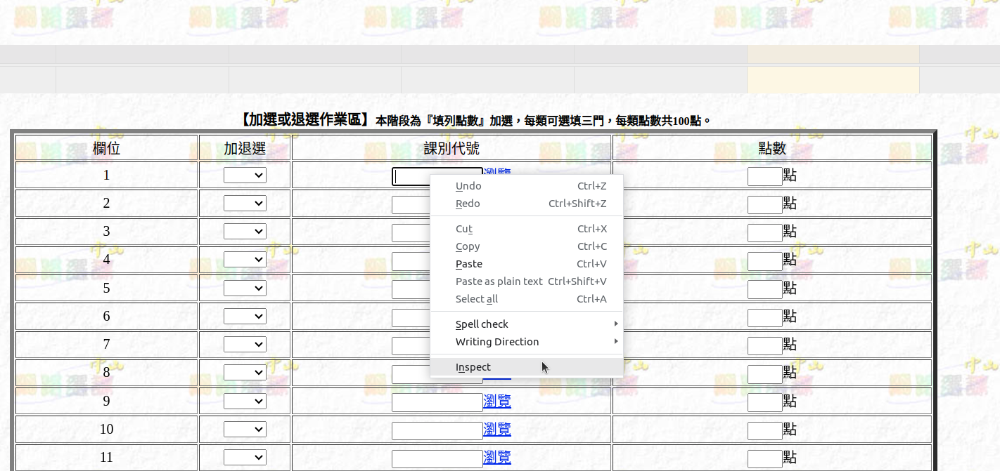

6. 在 console 中貼上剛剛的程式碼，若找不到 console 請搜尋「如何開啟(你使用的瀏覽器) console」。
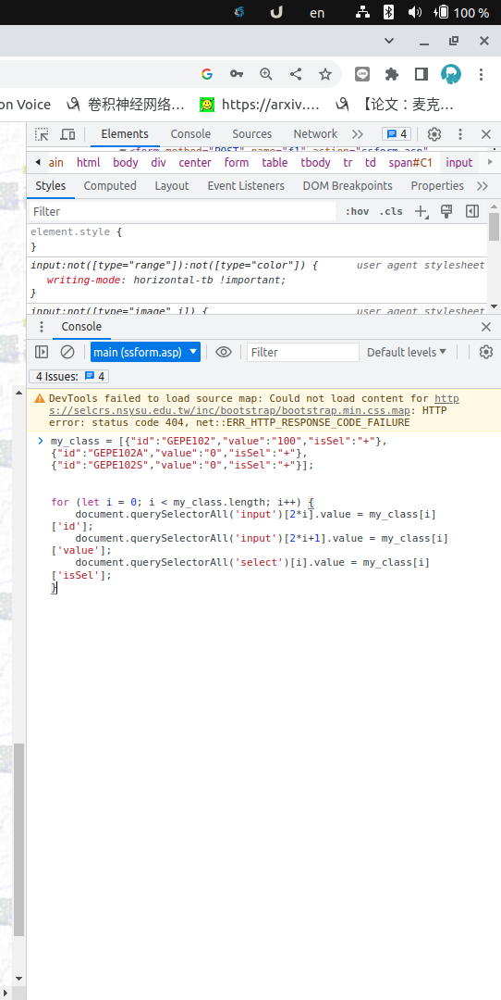

7. 貼上後直接按 Enter ，課程已經自動填入表格中。
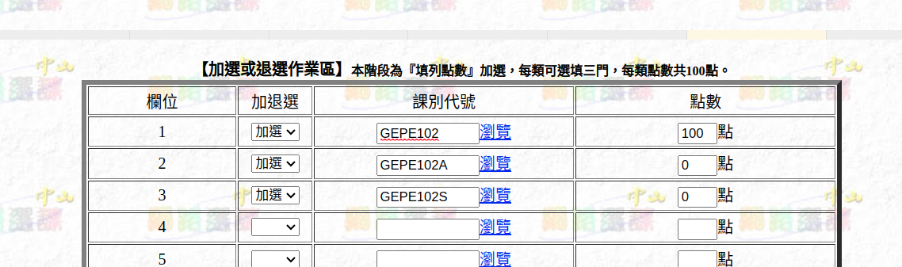

8. 之後，請照著正常的選課流程走即可。可使用暫存功能確認選課正確。
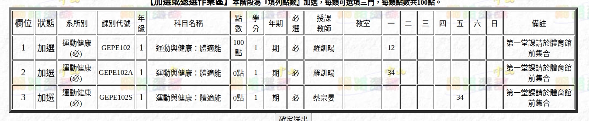

### **已選課程**
你所有選擇的課程會出現在這裡。

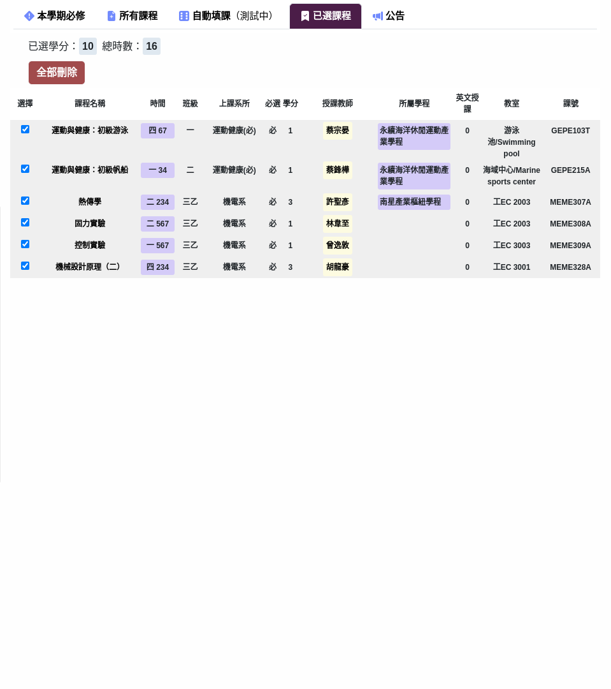

